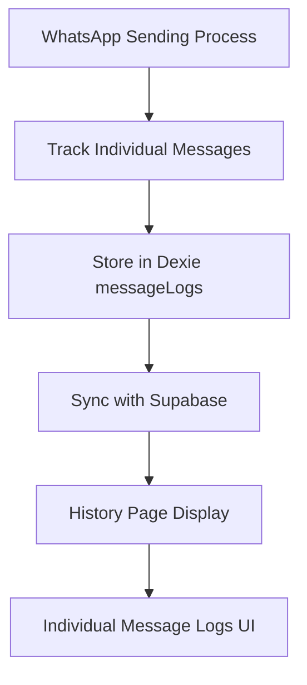

# 📋 History Page Analysis - Summary of Findings and Agreements

## 🔍 **Analysis Summary**

### **Problem Identified**
The History Page has a fundamental architectural mismatch between UI expectations and actual data availability:

- **UI Expectation**: "Individual Message Logs" - Detailed records of each message sent to individual contacts
- **Actual Implementation**: Only campaign/session logs (`activityLogs`) exist, no individual message tracking

### **Root Cause**
1. **Missing Database Infrastructure**: No `messageLogs` table exists in Dexie database schema
2. **Data Layer Issue**: `HistoryService.getAllMessageLogs()` tries to access non-existent `db.messageLogs` table
3. **Architecture Gap**: System tracks campaign-level activity but not individual message delivery status

## 🎯 **Key Findings**

### **Current Implementation Issues**
- **HistoryService** attempts to access `db.messageLogs` which doesn't exist
- **UI Strings** correctly describe what users need: "Individual Message Logs"
- **Available Data**: Only `activityLogs` (campaign/session level) exists
- **Error Handling**: May show generic errors instead of expected individual message data

### **Impact Analysis**
- **User Experience**: Users expect individual message tracking but get campaign-level data
- **Technical**: `historyService.getAllMessageLogs()` fails due to missing database table
- **Architecture**: Violates the UI's promise of detailed message-level tracking

## ✅ **Agreements Reached**

### **1. Data Fix, Not UI Fix**
- **Decision**: The issue is in the data implementation, not the UI
- **Rationale**: UI correctly represents what users need to see
- **Action**: Implement proper data infrastructure to support existing UI

### **2. Database Storage Approach**
- **Chosen**: Local Dexie database with Supabase sync
- **Rejected**: Cache with 7-day limit (violates local-first principle)

### **3. Implementation Requirements**
- **Add `messageLogs` table** to Dexie schema in `db.ts`
- **Implement individual message tracking** during sending process
- **Update HistoryService** to properly store/retrieve message logs
- **Maintain local-first architecture** with Supabase sync for backup

## 🚀 **Solution Architecture**

### **Recommended Implementation**


### **Database Schema Requirements**
```typescript
// Required: messageLogs table in Dexie schema
export interface LocalMessageLog extends MessageLog {
  _syncStatus: 'pending' | 'synced' | 'conflict' | 'error';
  _lastModified: string;
  _version: number;
  _deleted: boolean;
}

// MessageLog interface (existing)
export interface MessageLog {
  id: string;
  activity_log_id: string;
  contact_id: string;
  contact_name: string;
  contact_phone: string;
  status: 'sent' | 'failed' | 'pending';
  sent_at?: string;
  error_message?: string;
}
```

### **Implementation Steps**
1. **Add `messageLogs` table** to Dexie database schema
2. **Modify sending process** to log individual message status
3. **Update HistoryService** to handle message logs properly
4. **Implement sync mechanism** with Supabase for backup
5. **Ensure proper indexing** for efficient queries

## 📋 **Action Plan**

### **Phase 1: Database Infrastructure**
- [ ] Add `messageLogs` table to Dexie schema
- [ ] Create proper indexing for message queries
- [ ] Implement sync mechanism with Supabase

### **Phase 2: Message Tracking**
- [ ] Modify sending process to track individual messages
- [ ] Store message status during send operations
- [ ] Handle error cases and retries

### **Phase 3: Service Updates**
- [ ] Update `HistoryService.getAllMessageLogs()` to use real data
- [ ] Implement proper error handling
- [ ] Add fallback mechanisms

### **Phase 4: Testing & Validation**
- [ ] Test individual message tracking
- [ ] Verify History Page displays correct data
- [ ] Ensure offline functionality works

## 🎯 **Expected Outcomes**

### **After Implementation**
- ✅ History Page shows actual individual message logs
- ✅ Users can see per-contact message delivery status
- ✅ Detailed tracking of sent/failed/pending messages
- ✅ Full offline capability maintained
- ✅ Data synced with Supabase for backup

### **User Experience Improvements**
- **Accurate Data**: Individual message logs instead of campaign summaries
- **Better Tracking**: Per-contact message delivery status
- **Enhanced Analytics**: Detailed message performance insights
- **Offline Access**: Full functionality without internet

## 🔒 **Architecture Compliance**

### **Local-First Principle**
- ✅ All message logs stored locally in Dexie
- ✅ Offline functionality maintained
- ✅ Supabase used only for backup/sync

### **Data Retention**
- ✅ Permanent storage (not 7-day cache)
- ✅ Full historical tracking
- ✅ Audit trail capabilities

### **Performance Considerations**
- ✅ Proper indexing for fast queries
- ✅ Efficient sync mechanism
- ✅ Memory management for large datasets

## 📝 **Next Steps**

### **Immediate Actions**
1. Create database migration for `messageLogs` table
2. Implement message tracking in sending process
3. Update HistoryService to use real message data
4. Test and validate implementation

### **Future Enhancements**
- Add advanced filtering and search capabilities
- Implement message analytics and reporting
- Add export functionality for message logs
- Enhance error tracking and diagnostics

---
**Document Status**: Final
**Last Updated**: 2025-12-10
**Agreed By**: User and AI Analysis Team