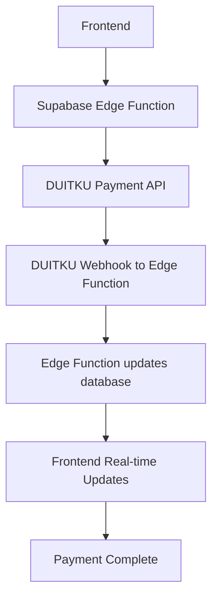

- Arsitektur Electron + Supabase (V2) - Updated with Supabase Edge Functions
- Strategi frontend berbasis **Vite + shadcn/ui + Animate UI**  
- Prinsip phased development  
- Rekomendasi UI/UX yang realistis dan performan  

# **Architecture Summary: Local-First WhatsApp Automation App - Xender-In**
**Version**: 2.2 — Supabase Edge Functions Integration
**Last Updated**: November 15, 2025
**Status**: MVP-Ready, Phased Execution Locked

---

## 1. Project Overview

**Xender-In** is a **local-first automation app** using **Electron** and **Supabase**, where WhatsApp automation runs **fully on the user's device** via `whatsapp-web.js` and Puppeteer.
Supabase handles **authentication**, **metadata**, **quota control**, **activity logging**, and **payment processing** via Edge Functions — **not runtime execution**.

> 🔑 **Core Principle**:  
> **Runtime and assets execute locally**; Supabase acts as **meta disk**, **quota enforcer**, **payment processor**, and **optional sync source**.

---

## 2. Full Technical Stack

### Desktop App (Electron Client)
- **Electron** – Main process (Node.js runtime)  
- **React (Vite + TypeScript)** – Renderer UI  
- **Preload.js** – Secure IPC bridge (limited API surface)  
- **Dexie** – Local IndexedDB (contacts, templates, WAL, assets)  
- **Keytar** – Secure JWT & local secrets storage  
- **whatsapp-web.js + Puppeteer** – Local WhatsApp session runtime  
- **Sharp** – Image compression before upload  

### Frontend (Renderer Layer)
- **Vite** – Build tool (HMR, fast dev server)  
- **Tailwind CSS** – Atomic styling  
- **shadcn/ui** – Base UI primitives (**open code**, no NPM wrapper)  
- **Animate UI** – Motion-enhanced components (**via `npx shadcn add`**)  
- **Lucide React** – Icons (tree-shakable, consistent with shadcn)  
- **Path alias**: `@/` → resolves to `/src` (IDE & build compatible)  

> ❌ **Tidak menggunakan**:  
> - `ui.aevr.space` (tidak valid / tidak terverifikasi)  
> - Magic UI (terlalu heavy untuk productivity tool)  
> - Library UI berbasis NPM (menghindari wrapper & bundle bengkak)

### Backend (Supabase)
- **Supabase Auth** (Email/Password)  
- **Postgres** – Tables: `subscriptions`, `team_members`, `reservations`, `activity_logs`  
- **Storage** – Asset backup  
- **RPC** – `reserve_quota`, `commit_reservation`  
- **Edge Functions** – Payment processing and webhook handling  
- **RLS** – Tenant isolation per `master_user_id`  

---

## 3. Frontend Strategy & Rationale

### ✅ Kenapa shadcn/ui + Animate UI?
- **Open code model**: semua komponen disalin ke `/src/components/ui/` → bisa di-edit sesuka lo  
- **Zero runtime overhead**: tidak ada wrapper, class conflict, atau styling leak  
- **Animate UI = shadcn + Framer Motion**: animasi micro-interaction (hover, load, exit) yang **ringan & accessible**  
- **Sangat cocok untuk Electron**: bundle minimal, tidak andalkan SSR/CDN

### 🛠 Setup Standard (Dari `Frontend Design_1_ReadME.md`)
```bash
npm create vite@latest my-app -- --template react-ts
cd my-app
npm install tailwindcss @tailwindcss/vite lucide-react
npx tailwindcss init -p
# → konfigurasi tsconfig.json + vite.config.ts untuk path alias "@/"
npx shadcn-ui@latest init  # pilih Neutral base color

# Tambah komponen
npx shadcn-ui@latest add button card input alert
npx shadcn-ui@latest add animated-button animated-card  # dari Animate UI registry
```

> 📌 Semua komponen masuk ke `src/components/ui/` → bisa dihapus di Phase akhir jika tidak dipakai.

### 🎨 UI Scope per Phase
| Phase | Komponen yang Dipakai | Animasi? |
|------|------------------------|--------|
| **Phase 1 (Mock UI)** | Button, Card, Input, Dialog, Tabs | ✅ `AnimatedButton` untuk action utama (Send, Reserve) |
| **Phase 2 (Real Data)** | Table, Skeleton, Progress, Alert | ✅ `FadeIn` saat load data |
| **Phase 3 (Polish)** | PIN Keypad, WAL Status, Sync Progress | ⚠️ Animasi **minimal** — fokus ke kejelasan |

> 💡 **Guideline**: Animasi hanya untuk **feedback & state change**, bukan dekorasi.

---

## 4. Core Execution Flow

### 🔹 Authentication
1. Login via Supabase Auth → Store JWT in **Keytar**  
2. Fetch metadata (`quota`, `plan`) → **50% sync rule**  
3. Show **Local PIN modal** (Owner/Staff)

### 🔹 Dual Sync System
| Type | Data | Trigger | Consent |
|------|------|--------|--------|
| **Auto Sync** | Account meta (quota, team) | Login | ❌ |
| **Manual Sync** | Contacts, templates, assets | Post-PIN | ✅ |

> ✅ User bisa skip manual sync → pakai data lokal

### 🔹 Payment Flow (Enhanced with Supabase Edge Functions)


### 🔹 Sending Flow (Phase 3)
1. Configure: group, template, delay  
2. **Reserve quota** → Supabase RPC  
3. Persist to **Dexie WAL**  
4. Execute via **WhatsApp State Machine**  
5. **Commit** → update quota + logs

---

## 5. Data Isolation & Cleanup

### 🔒 Per-User Isolation
All local data scoped by `master_user_id`:
```
%AppData%/Xender-In/{master_user_id}/
  ├── session/
  ├── dexie-db/
  └── assets/
```

### 🧹 Uninstall Cleanup
- Windows: `electron-builder` NSIS script hapus seluruh folder Xender-In
- Pastikan **tidak ada sisa session atau kontak**

---

## 6. Development Phases (Frontend-Aligned)

### Phase 1 — UI-First MVP (Mock Data)
- ✅ Full flow: login → PIN → contact list → send config → history  
- ✅ Pakai **shadcn/ui + Animate UI** untuk semua komponen  
- ❌ No Supabase, ❌ No Puppeteer  
- ✅ Abstraction layer: `ContactService`, `QuotaService` (mock → real swap)

### Phase 2 — Supabase Integration + Payment
- ✅ Replace mock dengan **real Supabase client**  
- ✅ Sync logic + WAL setup  
- ✅ **Supabase Edge Functions** for payment processing  
- ✅ **Simulate Send** → trigger commit tanpa WhatsApp

### Phase 3 — WhatsApp Runtime + Polish
- ✅ Integrate Puppeteer + **State Machine**  
- ✅ Final UI: error states, progress feedback, offline handling  
- ✅ **Cleanup**: hapus semua komponen UI yang tidak dipakai

---

## 7. Post-MVP Policy

- Setelah Phase 3 stabil: **HENTIKAN pengembangan Electron**  
- Buat `FUTURE_ARCHITECTURE.md` untuk **Admin Web UI** (separate project)  
- Semua perubahan Supabase wajib lewat **MCP workflow** (no Studio edits)

---

## 8. Key Principles Recap

1. ✅ **Local-first execution** = no backend dependency for runtime  
2. ✅ **Supabase = meta disk + payment processor**, bukan controller  
3. ✅ **Phased delivery**: UI → Backend → WhatsApp  
4. ✅ **shadcn/ui + Animate UI** = satu-satunya sumber komponen  
5. ✅ **Zero unverified UI libraries** (no AEVR, no Magic UI)  
6. ✅ **Per-user data isolation**  
7. ✅ **Uninstall cleanup enforced**  
8. ✅ **RPC = single source of truth untuk quota**  
9. ✅ **Edge Functions = secure payment processing**  
10. ✅ **Phase 3 = hard stop** → arsitektur baru untuk produk berikutnya

---

## 📚 Phase 3 Documentation Index

Semua dokumentasi untuk **Phase 3: WhatsApp Runtime Integration** tersimpan di folder `Plan/`:

### **1. Guide_to_Backend_Server_Whatsapp.md**
**Deskripsi**: Panduan lengkap implementasi WhatsApp runtime integration  
**Isi**:
- Overview arsitektur backend WhatsApp
- Current architecture summary (services, database, send flow)
- Phase 3 implementation plan (detailed)
- Core components to implement (WhatsAppManager, MessageProcessor, dll)
- Implementation steps (step-by-step)
- Detailed code examples
- Service integration guide
- State machine for message processing
- Error handling & retry logic
- UI integration
- Security considerations
- Testing strategy
- **Future Development**: Unsubscribe/Whitelist feature (Section 11)

**Kapan Digunakan**: Sebagai **main reference** untuk implementasi Phase 3

---

### **2. BACKEND_WHATSAPP_ANALYSIS_REPORT.md**
**Deskripsi**: Analisa komprehensif status projek & worker yang diperlukan  
**Isi**:
- Executive summary
- Struktur projek saat ini (frontend, database, service layer)
- Arsitektur backend WhatsApp yang akan dibangun
- **8 Worker yang diperlukan** (termasuk MessageReceiverWorker)
- Data flow: Send Message (end-to-end)
- Gap analysis (apa yang masih kurang)
- Kekuatan projek saat ini
- Rekomendasi urutan pengembangan (4 weeks roadmap)
- Questions for discussion

**Kapan Digunakan**: Untuk **memahami big picture** dan **planning** sebelum mulai development

---

### **3. WORKERS_IMPLEMENTATION_CHECKLIST.md**
**Deskripsi**: Checklist detail implementasi untuk setiap worker  
**Isi**:
- Quick summary (8 workers overview)
- Dependencies installation guide
- File structure to create
- **Detail checklist untuk setiap worker**:
  - Worker 1: WhatsAppManager
  - Worker 2: MessageProcessor
  - Worker 3: IPC Handlers
  - Worker 4: Preload Bridge
  - Worker 5: QueueWorker
  - Worker 6: SendWorker
  - Worker 7: StatusWorker
  - Worker 8: MessageReceiverWorker ⭐ (NEW)
- Configuration files (electron-builder.yml, vite.config.ts, package.json)
- Testing checklist (unit, integration, manual)
- Progress tracking (week-by-week)
- Critical issues to fix first
- Success metrics

**Kapan Digunakan**: Sebagai **task list** dan **progress tracker** selama development

---

### **4. UPDATE_SUMMARY_MESSAGERECEIVER.md**
**Deskripsi**: Summary update penambahan MessageReceiverWorker  
**Isi**:
- What changed (worker count 7 → 8)
- MessageReceiverWorker details
- Architecture impact (new event flow)
- Updated metrics
- Database schema impact (future tables)
- IPC integration (new channels)
- Testing impact
- Timeline adjustment
- Why build this now (rationale)
- Important notes (Phase 3 vs Future)

**Kapan Digunakan**: Untuk **memahami perubahan terbaru** dan **rationale** penambahan MessageReceiverWorker

---

### **5. TASK_TO_DO_AND_WALKTHROUGH.md**
**Deskripsi**: Task list terstruktur & panduan langkah-demi-langkah
**Isi**:
- Pre-requisites (Critical Fixes)
- Weekly Task List (Week 1 - Week 4)
- Walkthrough Guide (Step-by-step narrative)
- Tips for Success

**Kapan Digunakan**: Sebagai **daily guide** untuk developer saat mengeksekusi Phase 3

---

## 📖 Cara Menggunakan Dokumentasi

### **Sebelum Mulai Development**
1. Baca `BACKEND_WHATSAPP_ANALYSIS_REPORT.md` untuk big picture
2. Review `UPDATE_SUMMARY_MESSAGERECEIVER.md` untuk update terbaru
3. Baca `Guide_to_Backend_Server_Whatsapp.md` untuk detail implementasi

### **Selama Development**
1. Gunakan `WORKERS_IMPLEMENTATION_CHECKLIST.md` sebagai task list
2. Check off setiap item saat selesai
3. Refer ke `Guide_to_Backend_Server_Whatsapp.md` untuk code examples

### **Untuk Review & Planning**
1. `BACKEND_WHATSAPP_ANALYSIS_REPORT.md` - Status & roadmap
2. `WORKERS_IMPLEMENTATION_CHECKLIST.md` - Progress tracking
3. `UPDATE_SUMMARY_MESSAGERECEIVER.md` - Latest changes

---

📄 **Next**: Generate `FUTURE_ARCHITECTURE.md` setelah MVP selesai